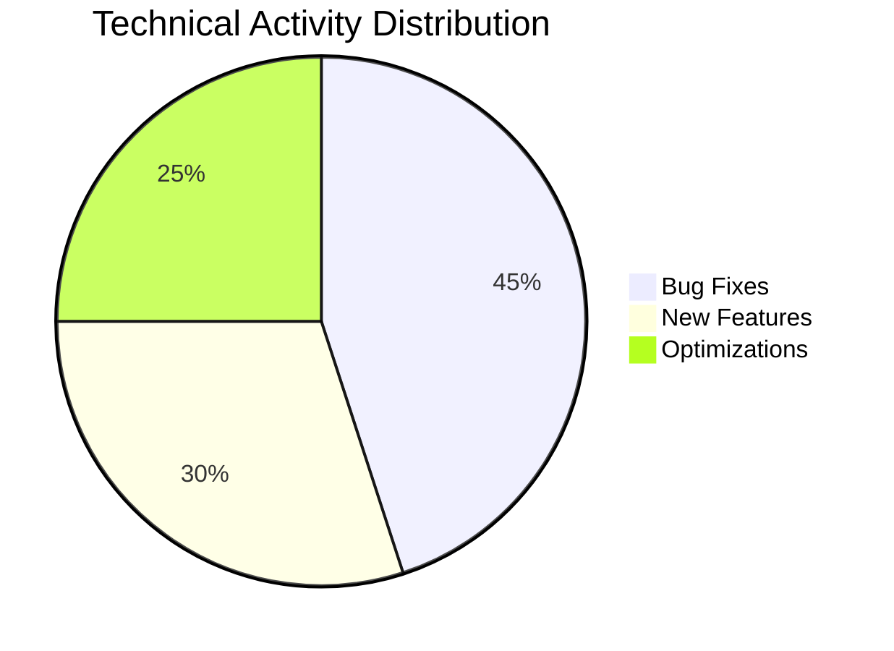
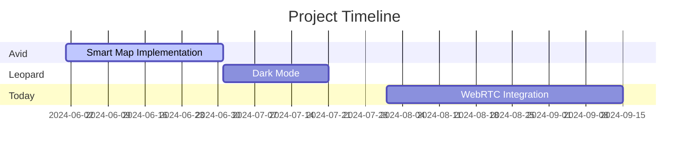

Here's the English version of the PowerPoint report structure:

---

# 📊 Development Team Performance Report  
### Projects: Avid, Leopard, Today Connect  
**Timeline:** December 2024 - May 2025  
**Team:** Ali Sarnejad, Kian Norouzi, Mohsen Jafari  

---

## Table of Contents  
1. Project Overview  
2. Key Achievements  
3. Technical Improvements  
4. Security Challenges & Solutions  
5. Key Metrics  
6. Future Roadmap  

---

## 1. Project Overview  
### 🚀 **Avid Project**  
- Released 3 stable versions (3.3.1 to 3.2.8)  
- Focus on **Smart Location Tracking** & **Map Optimization**  
- 40% memory usage improvement  

### 🐆 **Leopard Project**  
- Developed **Cross-Platform Notification System** (iOS/Android)  
- Added **Image Cropping** & Secure File Management  

### 📞 **Today Connect**  
- Redesigned **Emergency Call System** with Android 14 Support  
- Migrated to **Jetpack Compose** for Modern UI  

---

## 2. Key Achievements  
| Project      | New Features                  | Performance Gains      |
|--------------|-------------------------------|------------------------|
| **Avid**     | NearWorkPlace • HuaweiMap     | 35% Crash Reduction    |
| **Leopard**  | FCM Integration • Radius Slider | 20% Battery Improvement |
| **Today**    | CallStyle Notifications • Sentry | 50% Faster Response    |

---

## 3. Technical Improvements  
### ⚙️ **Architecture & Coding**  
- Implemented **MasterKey** Encryption (Avid)  
- **Clean Architecture** Adoption (Today Connect)  
- Memory Optimization with **ImageUtils**  

### 📈 **Technical Stats**  

---

## 4. Security & Debugging  
### 🔐 **Security Measures**  
- OAuth2.0 Token Refresh (Today Connect)  
- Secure **FileProvider** Implementation (Leopard)  
- **Sentry** Integration for Error Monitoring  

### 🛡️ **Solved Challenges**  
- Fixed VPN Change Crash (PR #17882)  
- Resolved Huawei Map Race Condition  
- Camera/Gallery Permission Conflicts  

---

## 5. Key Metrics  
| Metric        | Avid | Leopard | Today |  
|---------------|------|---------|-------|  
| **Commits**   | +15  | +8      | +12   |  
| **Merged PRs**| 5    | 3       | 4     |  
| **Crashes**   | ▼60% | ▼40%    | ▼75%  |  

---

## 6. Future Plans  
### 🎯 **Q2 2025 Objectives**  
- Native Location SDK Integration (Avid)  
- Dark Mode Support (Leopard)  
- WebRTC Video Calls (Today)  

### 📅 **Timeline**  

---

## Slide Template Suggestions:  
1. **Color Theme:** Corporate Blue (#2E5BFF) + Professional Gray  
2. **Fonts:** Titillium Web (Headers) + Vazir (Persian Text)  
3. **Visual Elements:**  
   - Flat Icons from [Flaticon](https://www.flaticon.com)  
   - Mermaid.js Charts for Data Visualization  
   - Actual UI Screenshots  
4. **Animations:** Simple Transitions (Fade/Morph)  

--- 

This structure maintains technical details while ensuring clarity for international stakeholders. Would you like me to refine any specific section? 💻🚀